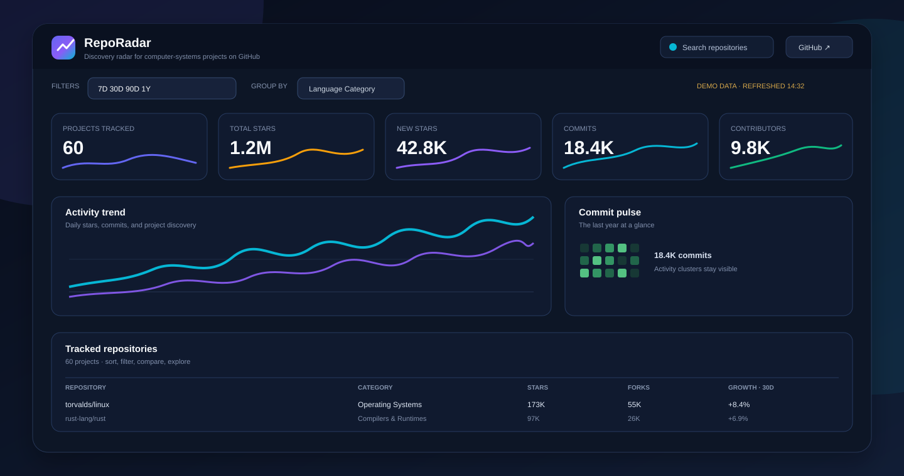
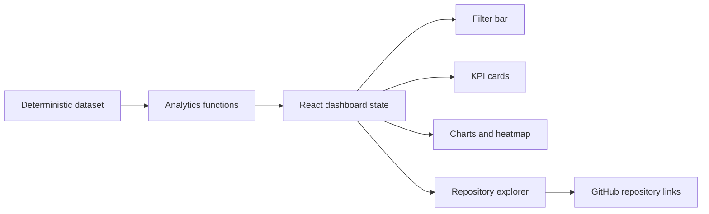

# RepoRadar

> A focused analytics cockpit for discovering momentum across computer-systems projects on GitHub.

<p align="center">
  
</p>

<p align="center">
  <a href="https://github.com/teb00/project-monitoring-dashboard"></a>
  <a href="https://github.com/teb00/project-monitoring-dashboard/blob/main/package.json"></a>
  <a href="https://vite.dev/"></a>
  <a href="https://www.typescriptlang.org/"></a>
</p>

<p align="center">
  <a href="#why-reporadar">Why RepoRadar</a> ·
  <a href="#what-is-inside">Features</a> ·
  <a href="#run-locally">Run locally</a> ·
  <a href="#architecture">Architecture</a> ·
  <a href="#roadmap">Roadmap</a>
</p>

## Why RepoRadar

GitHub has no shortage of repositories. The difficult part is seeing the shape of the ecosystem: which systems projects are gaining attention, which languages are moving, and where the interesting clusters are forming.

RepoRadar turns that exploration problem into a single, scan-friendly workspace. It is designed for engineers, technical founders, researchers, and curious builders who want a fast read on the computer-systems landscape without opening dozens of repository tabs.

This repository is currently a polished, self-contained demo. The interface is honest about that: the dataset is deterministic and simulated, so the dashboard is excellent for product exploration and frontend development without pretending to be a live GitHub integration.

## What is inside

- **Executive KPI strip** for tracked projects, total stars, new stars, commits, and active contributors.
- **Range analysis** across 7 days, 30 days, 90 days, and 1 year.
- **Activity and distribution views** with a trend chart and language/category breakdowns.
- **Commit pulse heatmap** for a year of simulated activity.
- **Ecosystem momentum** through a streamgraph and trending repositories.
- **Project landscape** with a responsive bubble chart and segment comparison.
- **Repository explorer** with search, language/category filters, sorting, pagination, growth sparklines, and GitHub links.
- **Cross-filtering** between visualizations and the repository table.
- **Shareable views** with range and grouping state preserved in the URL.
- **Dark mode**, reduced-motion support, keyboard-friendly table sorting, and accessible form labels.
- **Deterministic data generation**, which keeps screenshots and local development reproducible.

## Product principles

### Make the numbers trustworthy

A dashboard should not manufacture certainty. RepoRadar does not add random growth to headline metrics, and it shows `No baseline` when a comparable historical period is unavailable.

### Keep exploration close to action

Charts are not decoration. Selecting a segment narrows the repository view, while every repository links directly to GitHub for the next step.

### Favor signal over ceremony

The layout is deliberately dense but calm: strong hierarchy, restrained surfaces, compact controls, and visualizations that support scanning rather than compete with it.

## Run locally

### Requirements

- Node.js 20 or newer
- npm 10 or newer

### Install and start

```bash
npm install
npm run dev
```

Open the local URL printed by Vite, usually `http://localhost:5173`.

### Verify a production build

```bash
npm run build
npm run preview
```

The production build is configured as a single-file Vite output, which makes the demo easy to preview and share.

## Architecture



### Project layout

```text
src/
├── App.tsx                 # Dashboard composition and cross-filter state
├── types.ts                # Domain types for projects, metrics, and ranges
├── data/
│   ├── dataset.ts          # Curated projects and deterministic time series
│   └── analytics.ts        # KPI, segment, trend, and insight calculations
├── components/             # Header, filters, charts, table, and UI primitives
├── hooks/                  # Theme persistence and interval behavior
├── lib/                    # Number and percentage formatting
└── utils/                  # Small shared helpers
```

## Data model

The demo contains a curated set of real computer-systems repositories and generated historical signals:

- **365 daily points** for stars, commits, new repositories, and contributors.
- **Repository metadata** including language, category, stars, forks, contributors, and growth bias.
- **Seeded random generation** so the same inputs produce the same dashboard state.
- **No credentials and no network calls** are required to run the current version.

The simulated activity panel is intentionally labeled in the UI. It previews how a live event stream could feel without claiming that it is connected to GitHub.

## Roadmap

### Next up

- Connect a server-side GitHub data collector with caching and rate-limit awareness.
- Add loading, empty, stale-data, and error states around remote data.
- Add a repository detail drawer with recent releases, issues, pull requests, and contributor momentum.
- Add URL-persisted filters so dashboard views can be shared as links.
- Add automated unit, accessibility, and visual regression tests.

### Later

- Saved watchlists and comparison views.
- Alerts for unusual growth or activity drops.
- Exportable CSV and shareable report snapshots.
- Optional Supabase-backed history for long-term trend analysis.

## Quality checks

The current project is validated with:

```bash
npx tsc --noEmit
npm run build
```

The repository intentionally does not include a fake live API or hard-coded credentials. When a real data source is introduced, the next quality gate should include API contract tests, accessibility checks, and responsive visual regression at 320px, 768px, 1024px, and 1440px.

## License

No license has been selected yet. Add one before distributing RepoRadar as an open-source package.

## Acknowledgements

Built with React, TypeScript, Vite, Tailwind CSS, Framer Motion, and a lot of curiosity about the systems software ecosystem.
